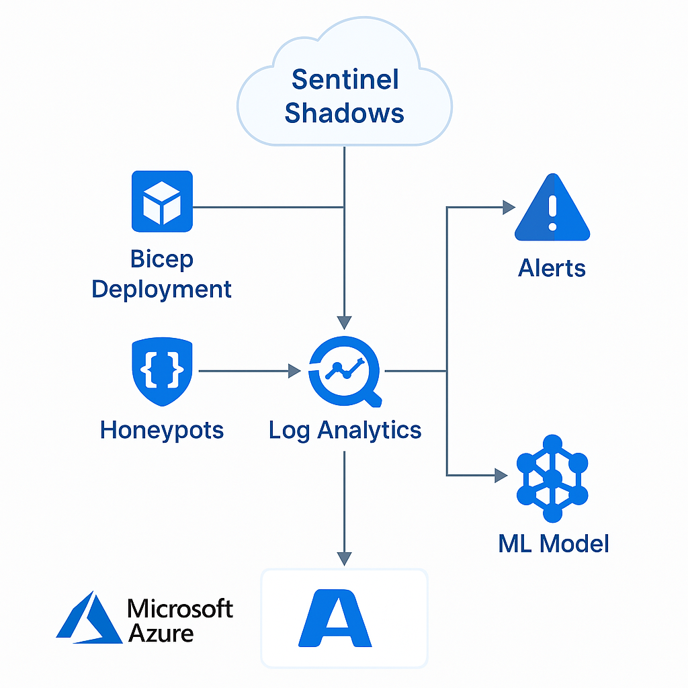

# sentinel.shadows
Sentinel Shadows – Deception-as-a-Service on Azure

Sentinel Shadows is a modular, cloud-native deception platform that helps defenders catch adversaries using traps, fake credentials, AI-based behavior analysis, and centralized SOC alerting — built 100% on Microsoft Azure

🔐 Phases

phase1_deception_layer/: Deploy decoys, honeypots, and trap credentials

phase2_logging_and_siem/: Configure Azure Monitor, Sentinel, and logging

phase3_ai_behavior_analysis/: AI models and notebooks to analyze attacker behavior

phase4_alerting_and_response/: Logic Apps, dashboards, and alert automation

🧰 Technologies Used
Azure Bicep for IaC
Azure Log Analytics & Microsoft Sentinel
Python Notebooks with AI/ML detection
Logic Apps & Workbooks

🚀 Deploy Example
bash cli azure 
  cd sentinel_shadows_phase1 
  az deployment group create --resource-group <your-rg> --template-file main.bicep

🤝 Contribute
This is an open-source effort. Feedback, forks, and feature requests welcome!

📜 License
MIT License
